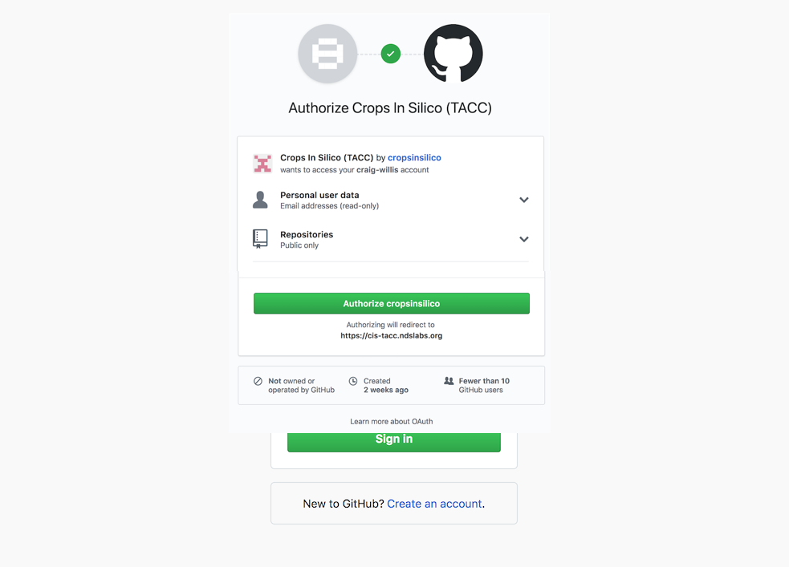
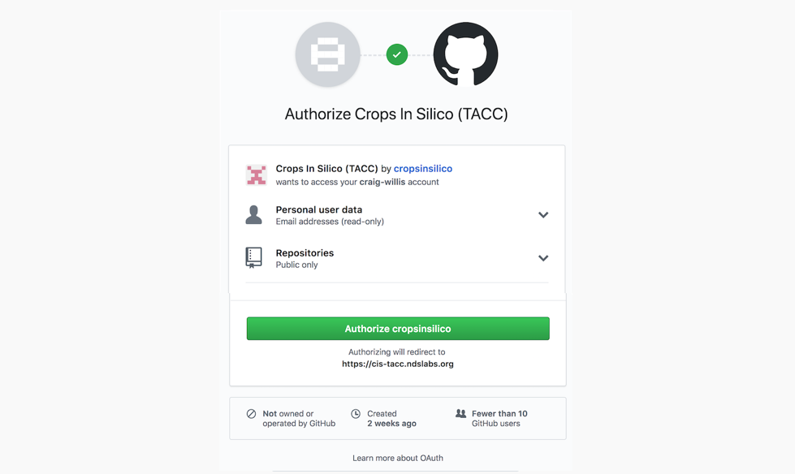
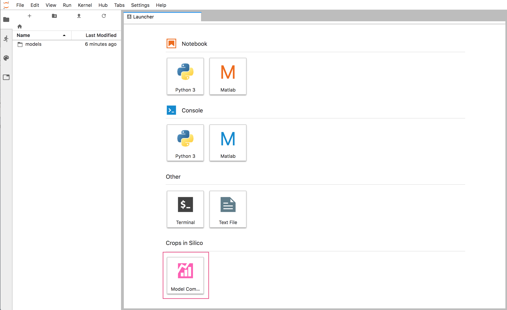
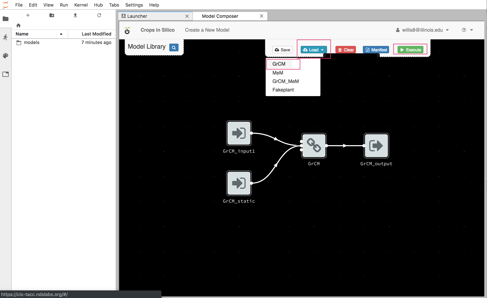
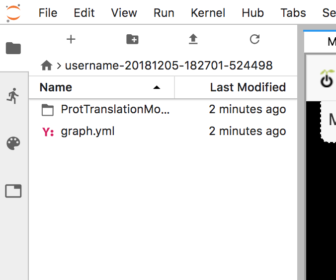
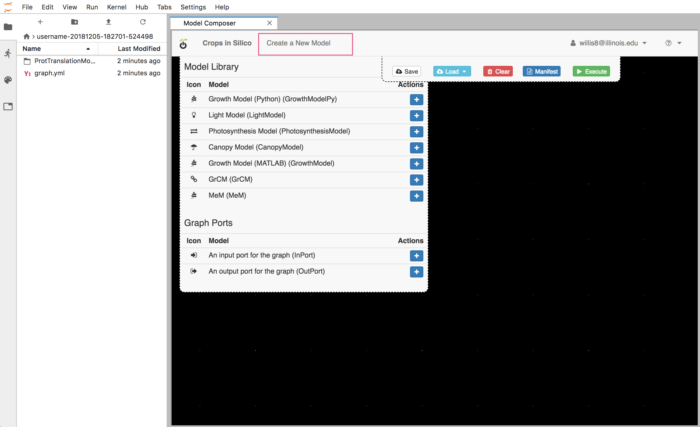

# Getting started

The Crops _in silico_ model composer is based on the popular JupyterLab 
web-based interactive analysis and development environment. JupyterLab
provides a complete development environment for the creation and execution
of models using the `cis_interface` integration framework. The model 
composer is a JupyterLab plugin that supports a visual-programming approach
to model composition.

## Logging in

To access the web service, go to
[https://cropsinsilico.ndslabs.org](https://cropsinsilico.ndslabs.org). The CiS
model composer uses GitHub for authentication. You will be prompted to sign-in
via GitHub and to authorize CiS to access information about you.
username.

Click on the "Sign in with GitHub" button:

Enter your GitHub credentials or create an account, if necessary:

If prompted, authorize "Crops in silico" to access your profile information:

## Starting JupyterLab

Once logged in, you will be able to start your JupyterLab instance.  Select
"Start My Server":

## Launching the Model Composer

Once started, you will see the JupyterLab launcher. This JupyterLab environment
is a complete development environment for use with the `cis_interface`
framework. You can create notebooks, execute commands from the terminal, or
launch the model composer.  Select the "Model Composer" icon: 

## Loading an Existing Model Graph

The model composer allows to to create and use models from the model library to
compose execution graphs.  Select the "Load" button to load the "GrCM" model:
and

## Executing the Graph

Select "Execute" to run the model.  Model output will be displayed on screen and
written to an model output directory for further exploration:

## Viewing Execution Output

The model output directory contains the graph, model source, inputs and outputs
used during execution:

## Using the Model Library

The model library lists all official models approved by the community as well as
any private models you have developed and added to the system.  You can use the
library to compose new graphs using this user interface:

## Next step
For more detailed usage information, please see the [User Guide](user_guide.html).

